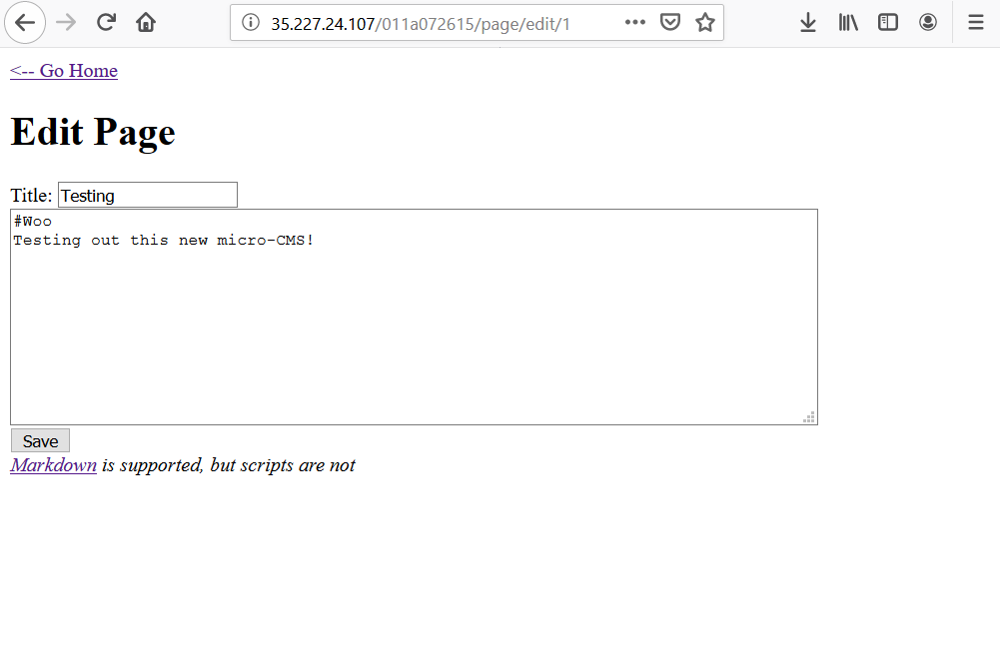
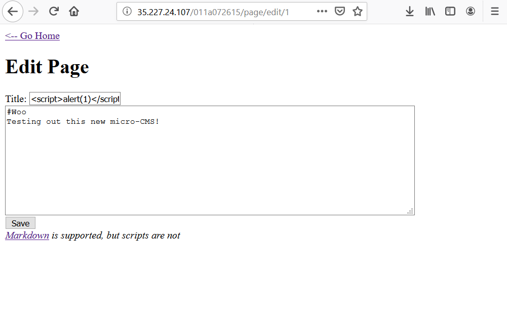
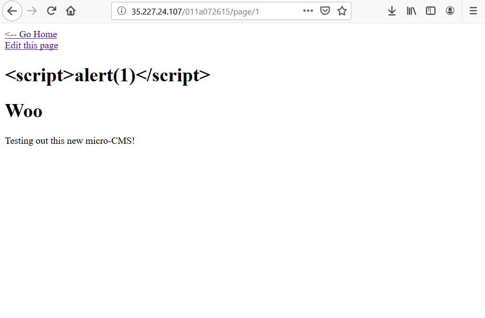
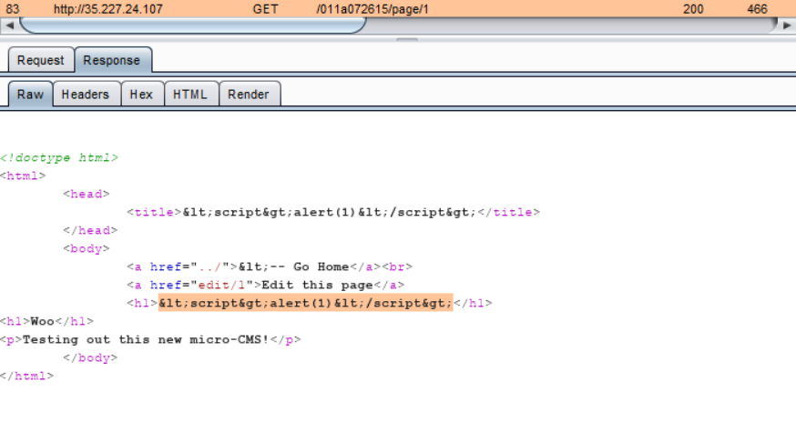
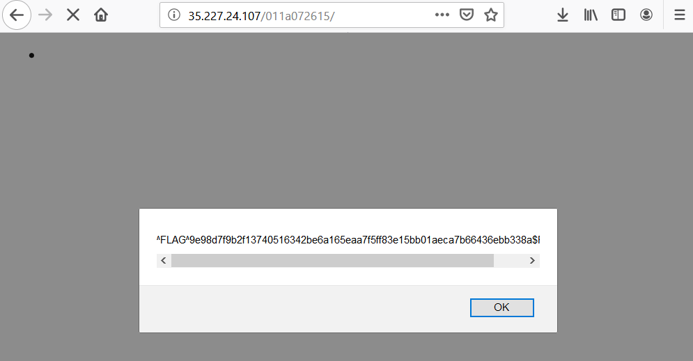

# Hacker101 CTF Write-Up

## Level 1: Flag 2

#### Vulnerability: Stored XSS

This level involves a very simple, and insecure, CMS application. Again, Firefox is set up to proxy all requests through Burp Suite Community Edition.

Looking at the user created pages, there seems to be the possiblilty of an XSS vulnerability.

The edit page contains two input fields. A text field for entering the page title, and a textarea for entering the body content.

Targeting the Title field, I entered a simple script tag.

After saving the new title, I'm redirected to the edited page. The script tags are displayed as the title, but no alert message appears.

Looking at the reponse in Burp, we can see why. The input is being sanitized by converting the angle braces to their character entities `&lt;` and `&gt;`. This causes the characters to display correctly, because the browser knows how to parse them, but prevents the input from being read as a script tag.

While it may look like this exploit has failed, the displayed page is not the only place that the input value is displayed. It's also displayed as an anchor tag on the home page. Let's take a look there...

And there's the flag!

This indicates that the user input is being stored as-is in the database. It's being sanitized on the main content page at runtime, but it is not sanitized on the homepage.
