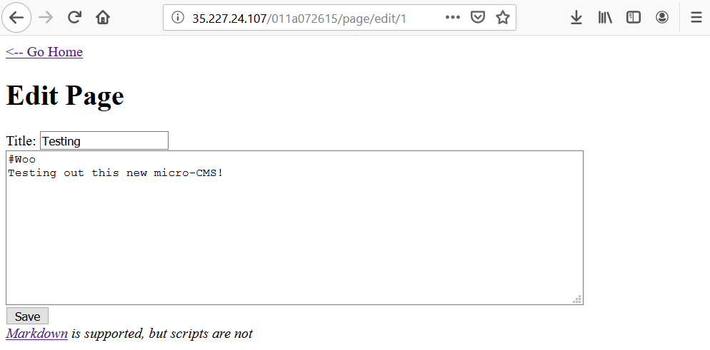
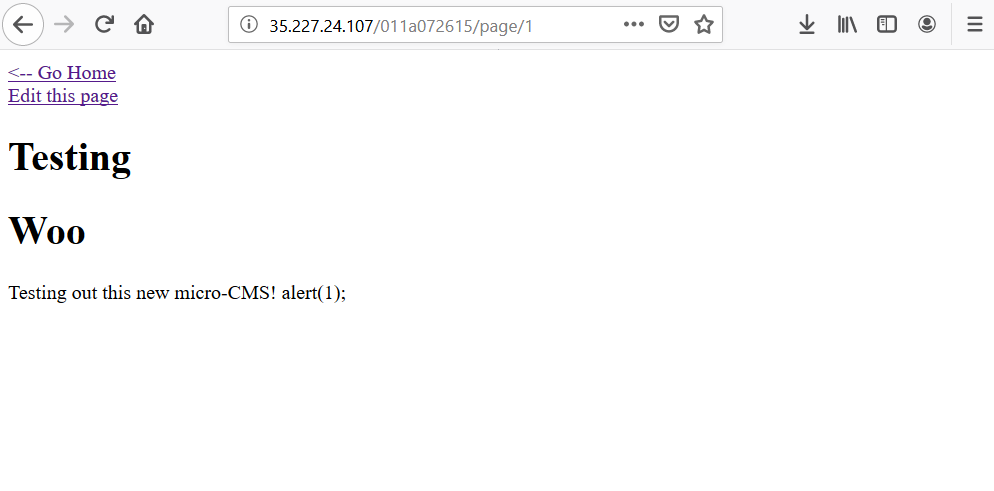
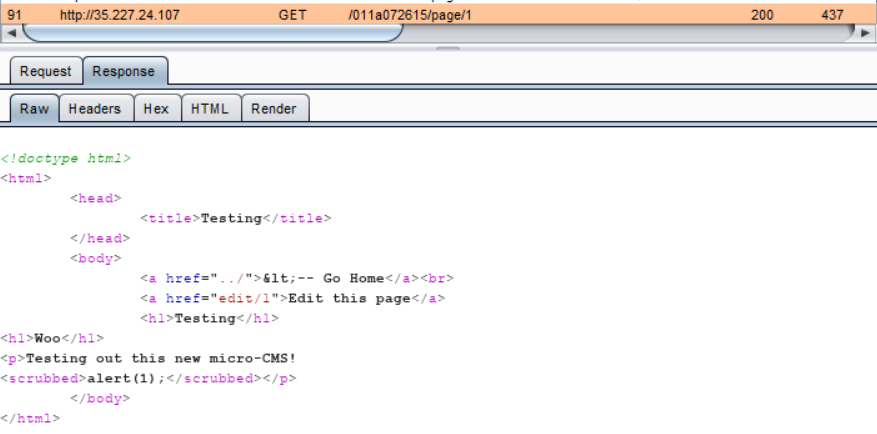
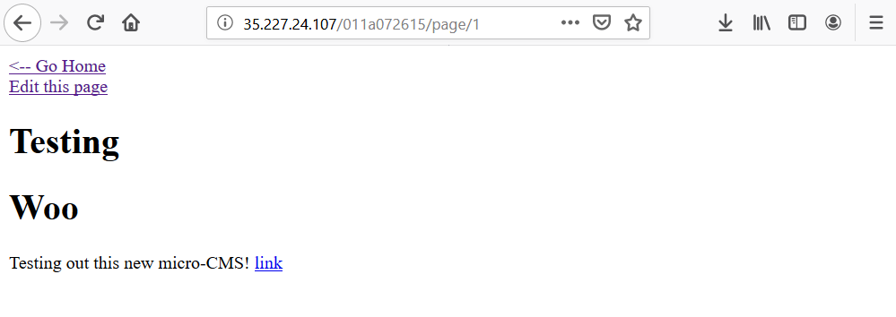
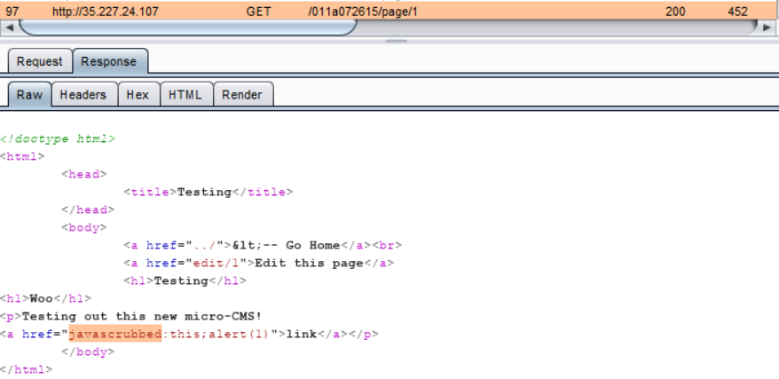
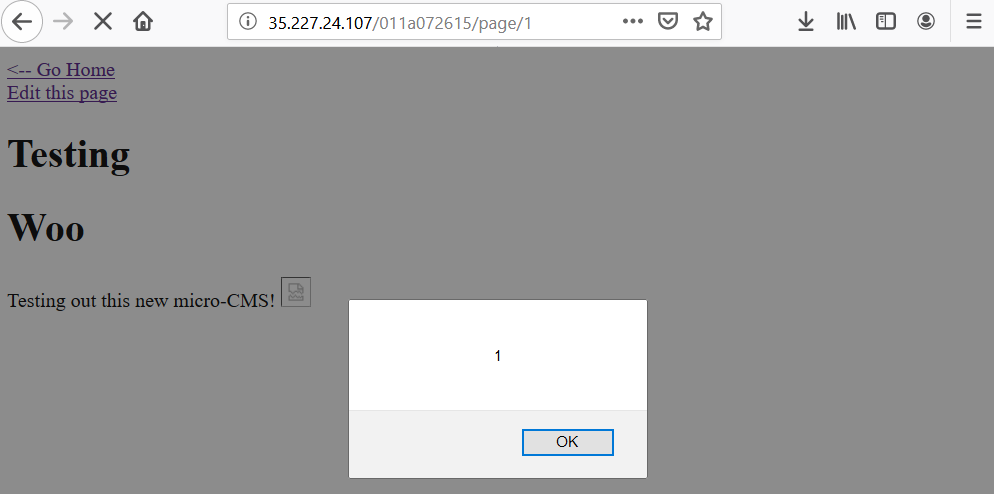
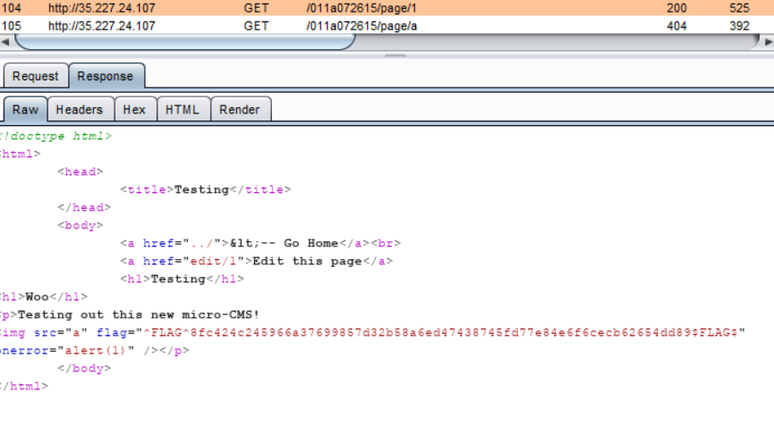

# Hacker101 CTF Write-Up

## Level 1: Flag 3

#### Vulnerability: Stored XSS

This level involves a very simple, and insecure, CMS application. Again, Firefox is set up to proxy all requests through Burp Suite Community Edition.

After finding flag #2 through an XSS exploit in the title input. It's time to take a look at the body input.



Based on the note at the bottom of the input, it's safe to assume that they are going to be on the lookout for script tags, but let's see what happens...



Well, the JavaScript command that I entered is there, but it's printing it to the screen instead of executing it. Let's take a look at Burp for more information.



It looks like `<script>` tags are being converted to `<scrubbed>` tags. Since these are invalid HTML tags, the browser just ignores them and prints what's in between.

Luckily, using script tags isn't the only way to get JavaScript to run on a page. Let's try adding a markdown link with this payload.

```javascript
[link](javascript:this;alert(1))
```





The link shows up, but if you click it, the browser lets you know that it doesn't understand the link. Again, the Burp response shows why. The `javascript` that I input is now `javascrubbed`. It looks like the site is sanatizing the user input by replacing the word `script` with `scrubbed`.

So I need to get JavaScript to run without using the word "script". That's easy enough. Let's insert an image tag with an invalid `src` and run the JavaScript with the `onerror` property. The new payload looks like this

```html

```



There's the alert, so our payload worked!



And there's the flag, enbeded in our successfully deployed image tag.
