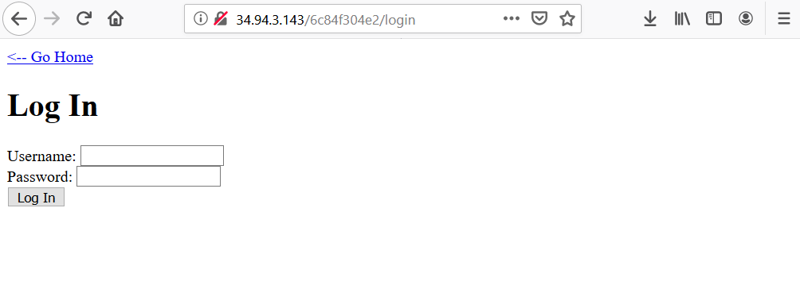
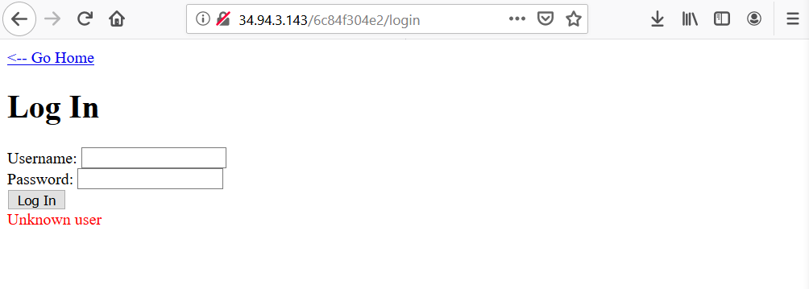
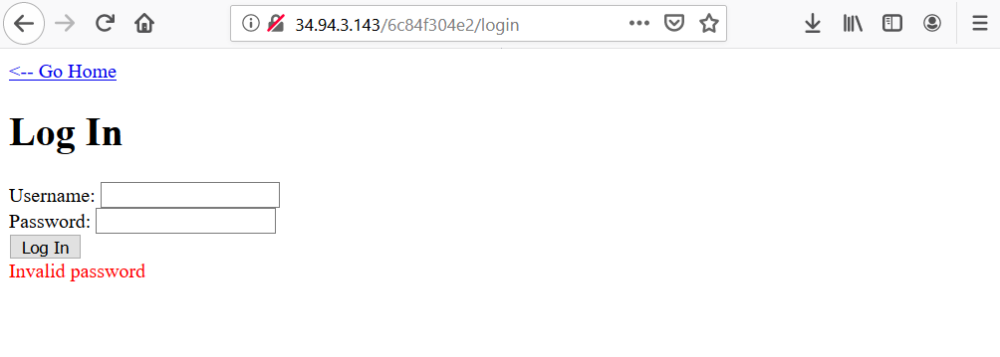
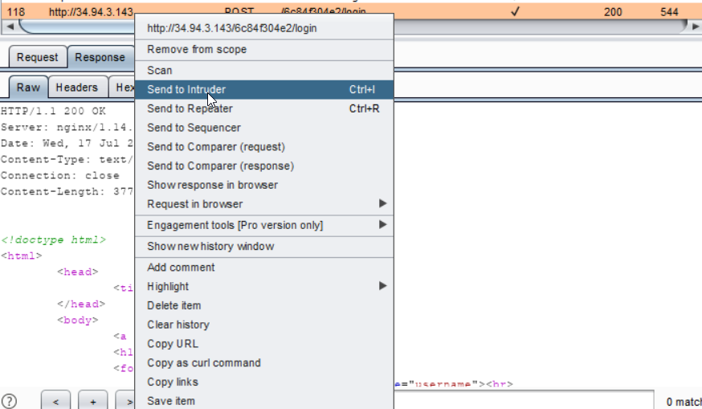
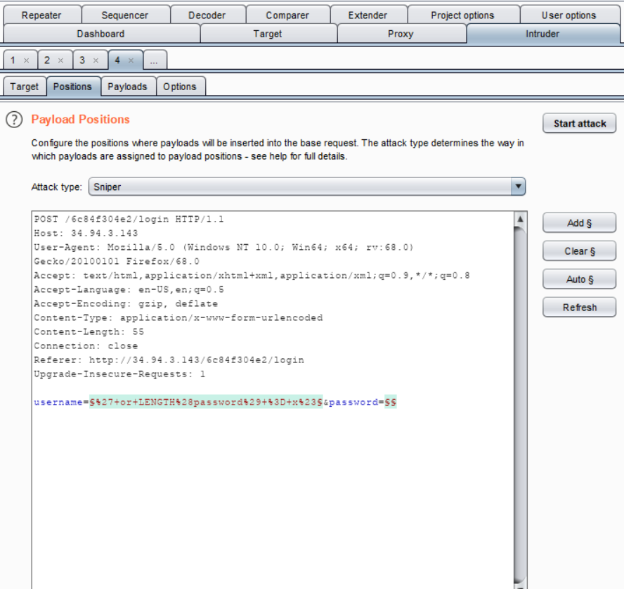
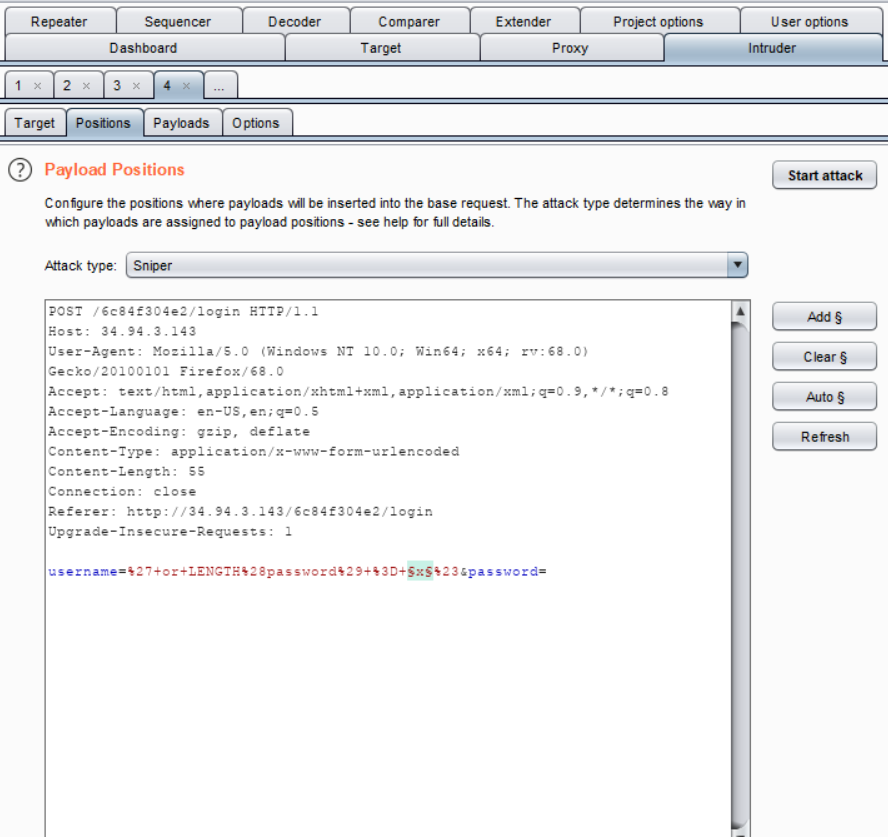
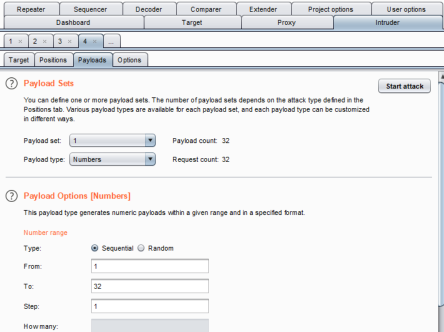
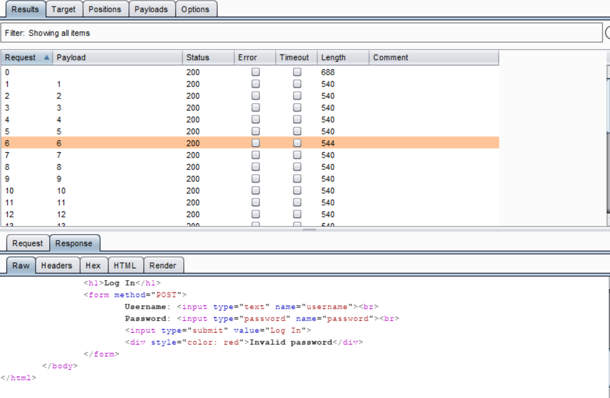

# Hacker101 CTF Write-Up

## Level 2: Flag 0

#### Vulnerability: SQL Injection, Improper Error Handling

The target application for Level 2 is an update to the CMS from Level 1. Again, Firefox is setup to proxy requests through Burp Suite Community Edition.

The application still appears to have very similar functionality to version 1, but it now requires a user to log in before editing a page.



This seems like a good place to start. Let's see if there's the potential for SQL injection by passing an apostrophe (`'`) in the username field.


Sure enough, that caused an error. There are a couple of issues to note here. First, there does appear to be a SQL error that we can probably exploit. Second, this application is returning error information that should not be displayed to the end user. If they were handling this error properly it would at least make exploiting the SQL more difficult. As it is, we can see exactly what the statement is.

We can learn quite a bit from this error message. We know that this application is built in Python 2.7, and it's using MariaDB. We also know that the login request triggers a SQL SELECT statement to get the `password` from the `admins` table.

The SELECT statement is the part that we're really interested in.

```SQL
SELECT password FROM admins WHERE username='%s'
```

There's also this bit: `request.form['username'].replace('%', '%%')`, which indicates that the user input is being sanitized by replacing '%' with '%%'. I'm not entirely sure what that would prevent, but it certainly isn't going to be enough to prevent us from getting in.

Before I start trying injections, I want to gather a little more information about how the system works. I noticed that if I hit submit without inputing anything into either field, I get an "Unknown user" message below the form.



This means that the application may be handling unknown users differntly than invalid passwords. If that's true, I may be able to use the responses for a blind SQL injection.

First, to make sure the two types of errors are being handled differently, I'll use a SQL payload that should make the SQL statement return true.

```SQL
' OR '1'='1
```



Sure enough, we now see a different error message: "Invalid password". This means that if our payload is `true` we will get the "Invalid password" response, and if it's `false`, we'll get the "Unknown user" response.

Next, I want to see if I can find the length of the password. To do this, I'll use this payload, where x is an integer variable.

```SQL
' or LENGTH(password) = x#
```

I'm going to use Burp to automate this part. First, I send the payload without swapping x for a number. This causes another error, but that's not important right now. I just want the payload to be saved in my Burp history to make it easier to set up Intruder. In the Proxy section, under the HTML History tab, I find the last POST request that I executed. I right click the entry, then click "Send to Intruder" in the context menu.



Switching to the Intruder section in Burp and clicking on the Positions tab, I can see the request with pre-selected payload positions.



These positions are tagged by default, but they aren't what I'm looking for in this attack, so I remove them with the Clear button to the right of the text area.

Next, I highlight the `x` variable in my payload and click the Add button.



Then, I switched over to the Payloads tab. The payload type is numbers, and the options are set to run from 1 to 32 in increments of 1.



This attack will send the request 32 times replacing the `x` in the payload with the next number in the list. Once the attack is finished running, I take a look at the results and find something interesting.



Most of the requests have a length of 540, with the exception of request 6. And looking at the response, sure enough, it has the "Invalid password" message. That means the password is 6 characters long!

Given that information, I need to design another payload that could help find those six characters. It's going to look like this:

```SQL
 ' or password LIKE "______"#
```

Using Intruder, I'll incrementally replace each position with alph-numeric characters to find the password. This requires a lot more requests, and since the community edition of Burp throttles Intruder attacks, it can take quite a while to complete. Once it's done, we can sort the requests by length, and we have the password: `tamera`


Now that I have the password. I can use the SQL payload from before to make username true, and enter the password.


And there's the flag!
